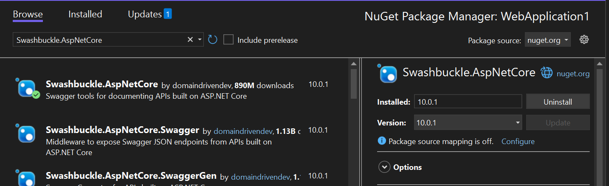
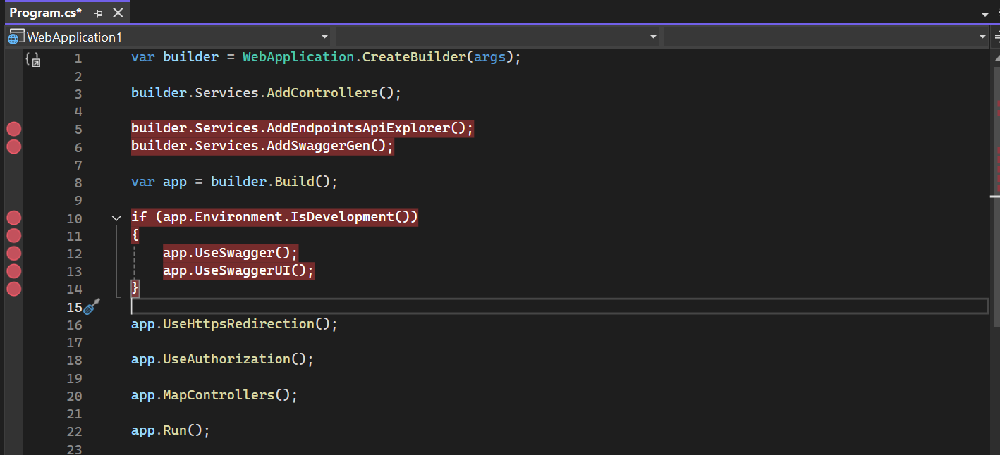
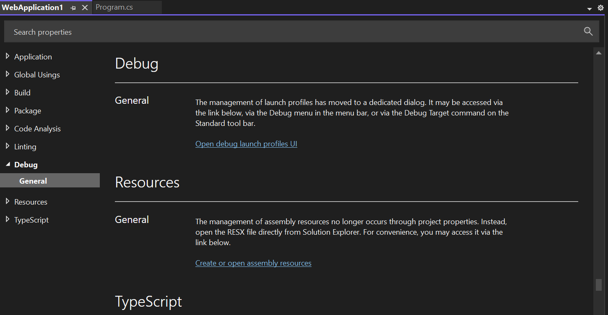
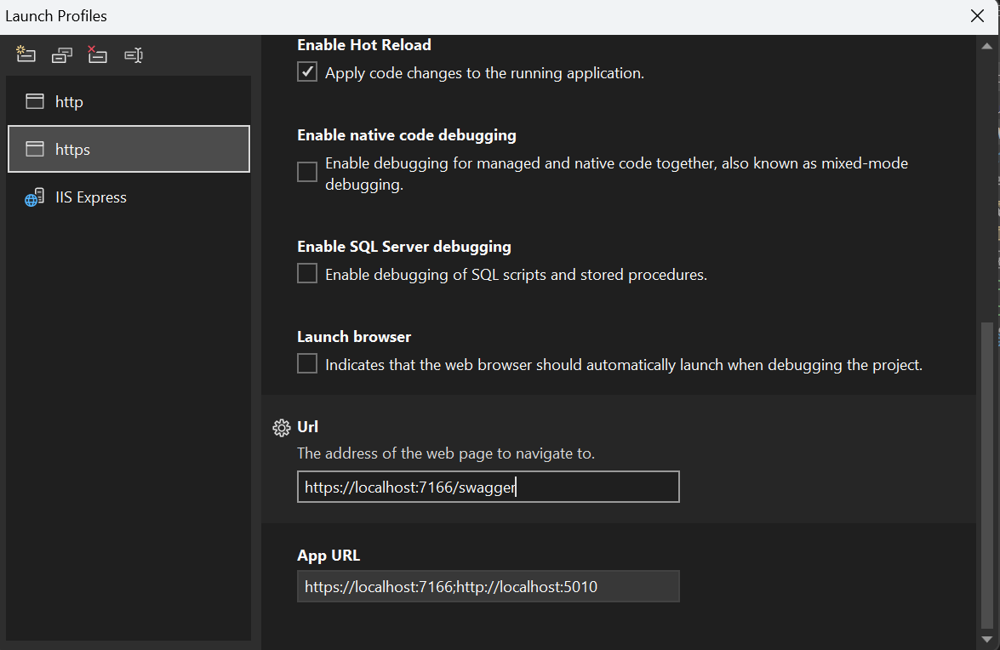
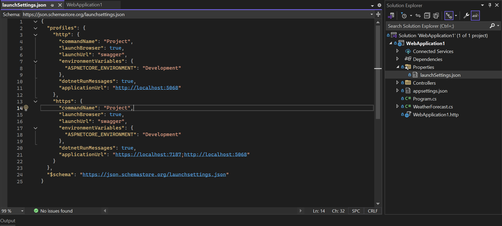
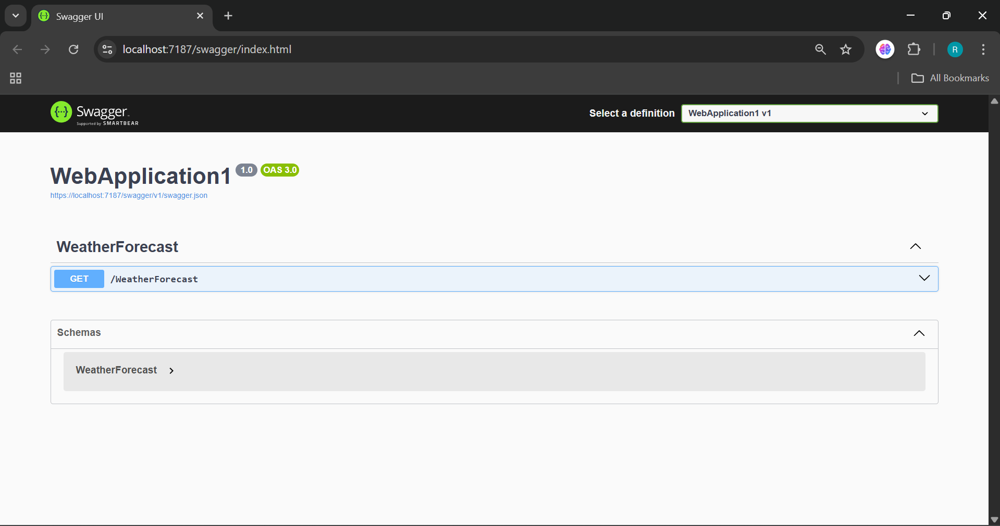

# Enabling Swagger in ASP.NET Core (.NET 8 and .NET 9)

> **Note:** Starting from **.NET 8**, Swagger is *not* included automatically. Microsoft removed the built‑in OpenAPI/Swagger configuration, so developers must **manually install and configure Swashbuckle** to bring Swagger UI back.

---

## 📘 Why Do We Need to Install Swagger Manually?

Beginning with **.NET 8 and .NET 9**, the default project template **no longer adds Swagger or OpenAPI middleware**. That means:

* Swagger **does not open automatically**
* Swagger **is not installed by default**
* You must manually add the **Swashbuckle.AspNetCore** package
* You must manually add code in `Program.cs`
* You must update `launchSettings.json` to auto‑open the Swagger UI

Microsoft shifted to a more minimal API template and removed “automatic” Swagger because not every API needs documentation by default.

---

## 📌 Steps to Enable Swagger

Below are step‑by‑step instructions with placeholders where you can insert screenshots.

---

## **1️⃣ Install Swashbuckle via NuGet**

1. Right‑click the project → **Manage NuGet Packages**
2. Go to the **Browse** tab
3. Search for `Swashbuckle.AspNetCore`
4. Install the version matching your .NET version (e.g., **v9.x** for .NET 9)



---

## **2️⃣ Add Swagger Services in Program.cs**

Add these **before** `var app = builder.Build();`:

```csharp
builder.Services.AddEndpointsApiExplorer();
builder.Services.AddSwaggerGen();
```

Then add this **after** `var app = builder.Build();`:

```csharp
if (app.Environment.IsDevelopment())
{
    app.UseSwagger();
    app.UseSwaggerUI();
}
```



---

## **3️⃣ Configure Swagger to Open Automatically (Visual Studio)**

### **A. Open Debug Launch Profiles**

1. Right‑click project → **Properties**
2. Click **Debug**
3. Open **Debug Launch Profiles UI**



---

### **B. Set Launch URL to Swagger**

In the **Application URL**, append `/swagger`:

```
https://localhost:7187/swagger
```



---

## **4️⃣ Update launchSettings.json**

Open **Properties → launchSettings.json** and modify:

```json
{
  "profiles": {
    "http": {
      "commandName": "Project",
      "launchBrowser": true,
      "launchUrl": "swagger",
      "environmentVariables": {
        "ASPNETCORE_ENVIRONMENT": "Development"
      },
      "dotnetRunMessages": true,
      "applicationUrl": "http://localhost:5068"
    },
    "https": {
      "commandName": "Project",
      "launchBrowser": true,
      "launchUrl": "swagger",
      "environmentVariables": {
        "ASPNETCORE_ENVIRONMENT": "Development"
      },
      "dotnetRunMessages": true,
      "applicationUrl": "https://localhost:7187;http://localhost:5068"
    }
  },
  "$schema": "https://json.schemastore.org/launchsettings.json"
}
```



---

## **5️⃣ Run the Project**

Now press **F5** → Swagger will automatically open:

```
https://localhost:xxxx/swagger
```



---

## 🎉 Final Result

You now have:

* Swagger installed ✔️
* UI enabled ✔️
* Automatic opening ✔️
